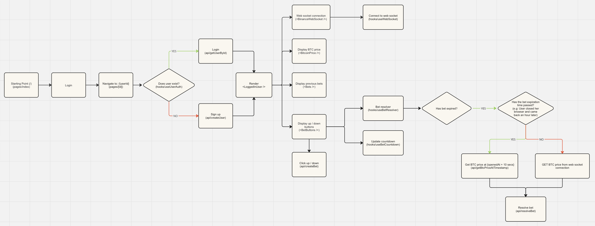

### Deployed app

[Click to visit deployed app](https://betting-app-seven.vercel.app/)

### Check List

- ✅ The player can at all times see their current score and the latest available BTC price in USD
- ✅ The player can choose to enter a guess of either “up” or “down“
- ✅ After a guess is entered the player cannot make new guesses until the existing guess is resolved
- ✅ The guess is resolved when the price changes and at least 10 seconds have passed since the guess was made
- ✅ If the guess is correct (up = price went higher, down = price went lower), the user gets 1 point added to their score. If the guess is incorrect, the user loses 1 point.
- ✅ Players can only make one guess at a time
- ✅ New players start with a score of 0
- ✅ The guesses should be resolved fairly using BTC price data from any available 3rd party API
- ✅ The score of each player should be persisted in a backend data store (AWS services preferred)
- ✅ Please provide us a link to your deployed solution.
- ✅ Optional: Players should be able to close their browser and return back to see their score and continue to make more guesses

## Getting Started

First, run the development server:

```bash
// If you run into issues when running `npm install` add `--force` flag
npm install
npm run dev
```

Open [http://localhost:3000](http://localhost:3000) with your browser to see the result.

### Environment variables

Add these to your `.env.local` file

```
NEXT_PUBLIC_ACCESS_KEY_ID=GET_VALUE_FROM_YOUR_OWN_AWS_CONSOLE

NEXT_PUBLIC_ACCESS_KEY_SECRET=GET_VALUE_FROM_YOUR_OWN_AWS_CONSOLE
```

### Running tests

```bash
npm run test
```

### Deployment

```bash
npx vercel --prod
```

### How this app works

[Click to open Miro board](https://miro.com/app/board/uXjVKJyHn68=/?share_link_id=619037807762)


### Possible improvements for future

- Use AWS Step functions to resolve bets after the expiration time.

Ideally something like this:

```javascript
resolveBet(resolveParams, { delay: betDuration });
```
